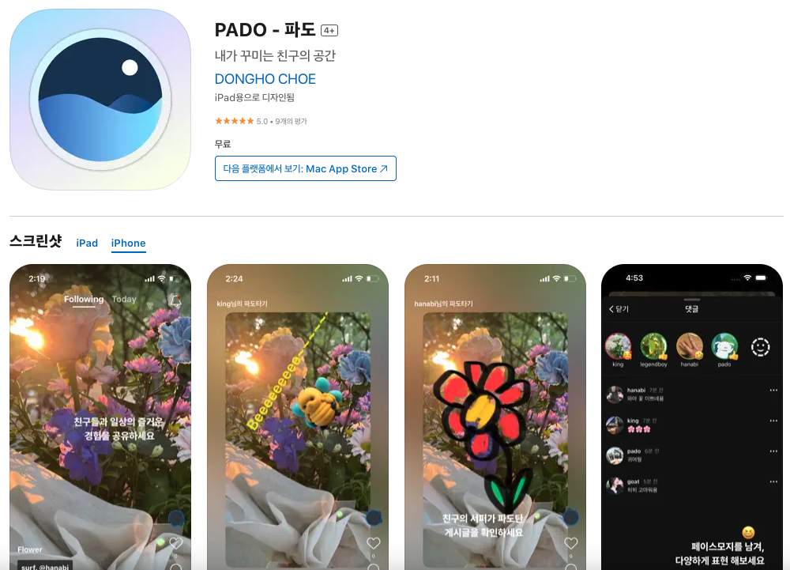
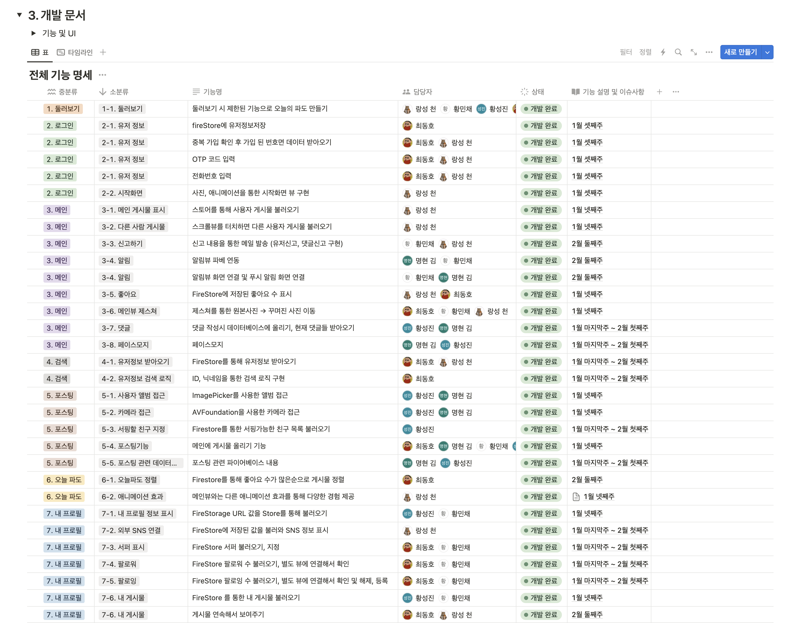
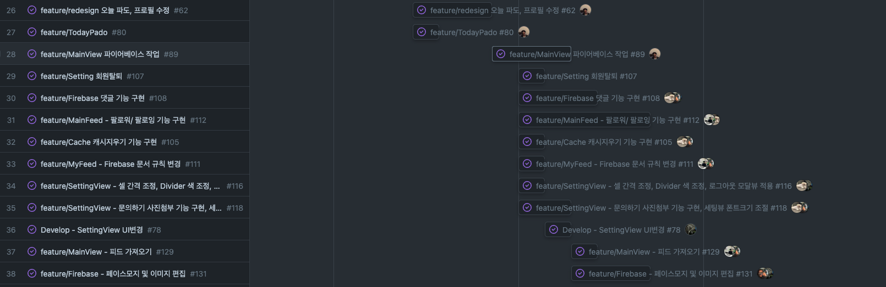
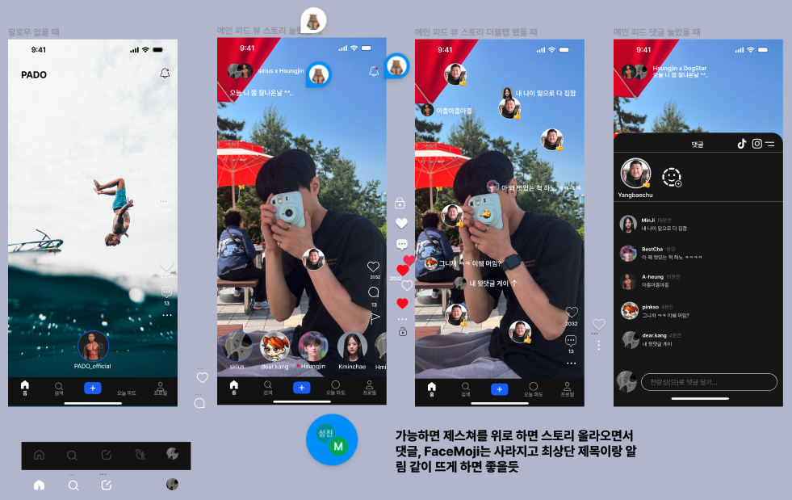
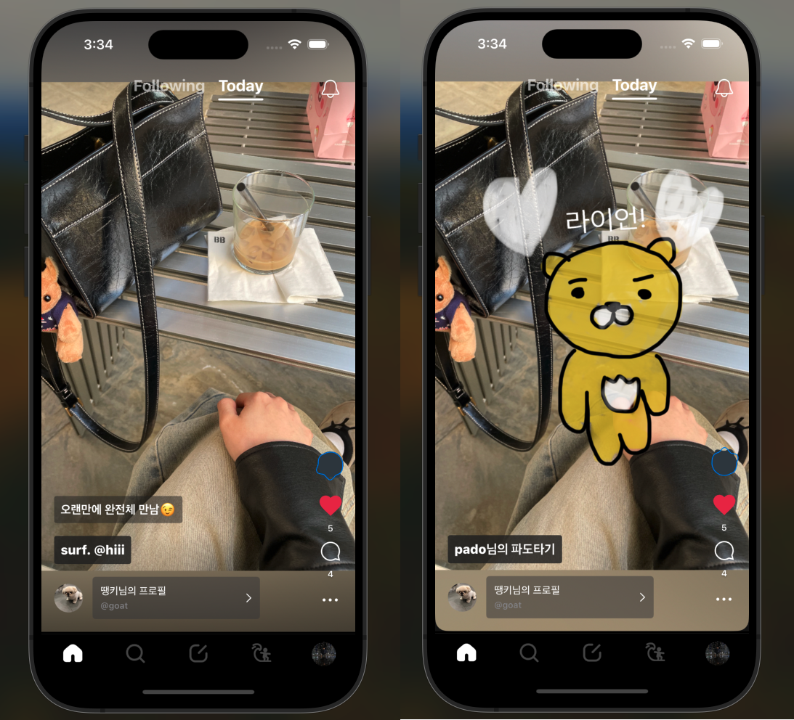
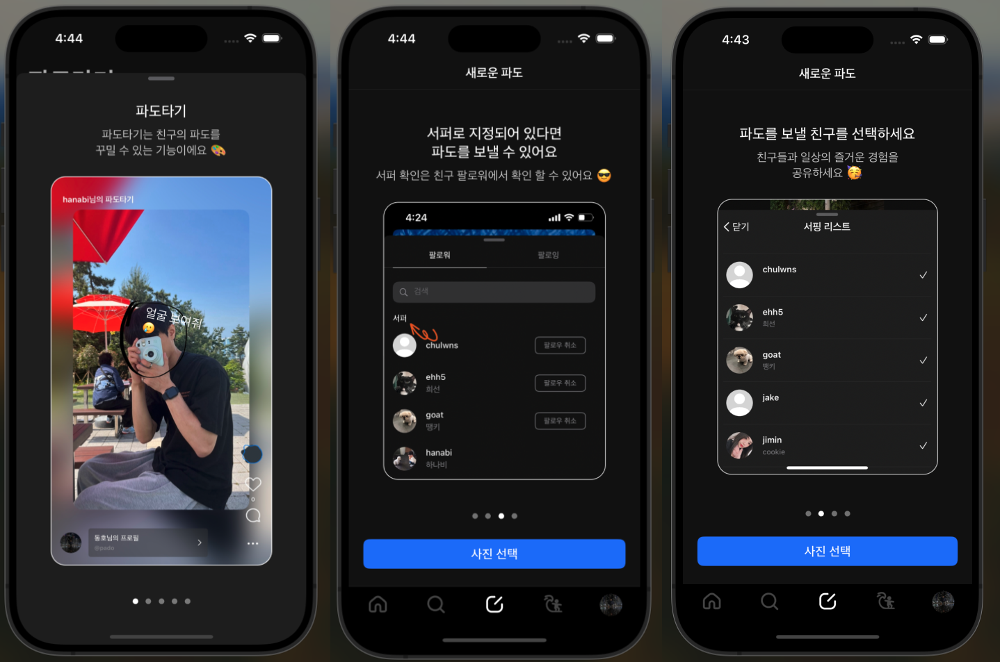
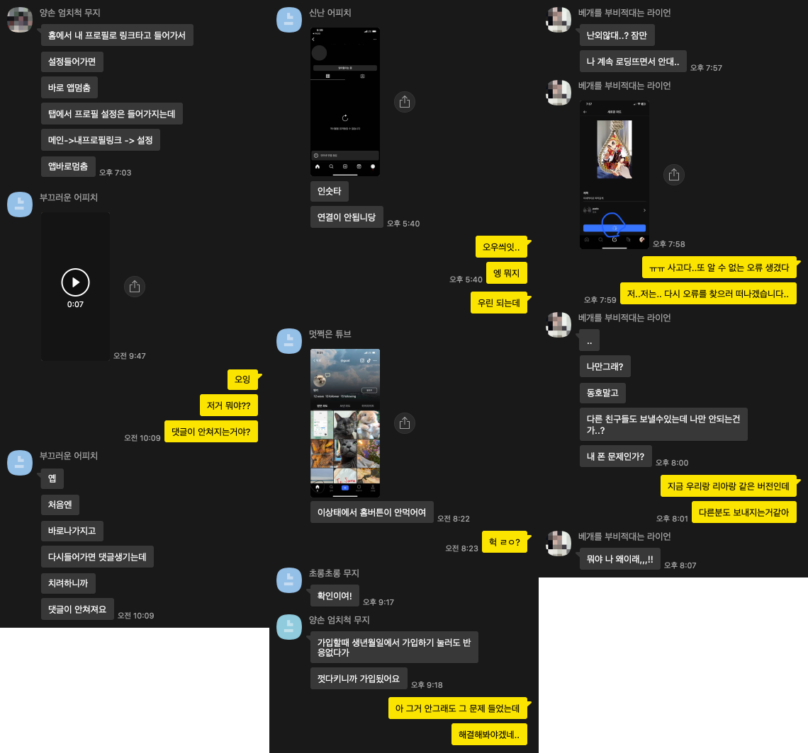

## 🎉 결과물

[앱스토어링크](https://apps.apple.com/kr/app/pado-%ED%8C%8C%EB%8F%84/id6475384446)



### GitHub url

[깃허브](https://github.com/4T2F/PADO)


### 시연 영상

[유튜브](https://youtu.be/WunGmdgTe9U)

[인스타그램](https://www.instagram.com/p/C33l_NYSLv_/)

## ⭐️ 프로젝트 시작  

프로젝트의 출발은 해외에서 인기를 끌고 있는 BeReal 앱을 참고하여 시작되었다. BeReal은 사용자들이 자신의 진정한 모습을 공유하는 플랫폼으로, 이를 참고하여 진실된 자아를 나타내는 앱을 개발하고자 하였다.

인스타그램은 초기에는 사용자들이 자신의 일상을 공유하는 공간으로 시작되었다. 그러나 현재의 인스타그램은 이 초기 목적과는 다소 거리가 먼데, 대부분의 사용자들이 자신의 일상이 아닌 과시가 목적인 사진이나 진짜 내 모습이 아닌 허상의 사진들을 올리는 경향이 많다. 이에 대한 반발로, 우리는 진짜 자신의 모습을 공유하는 새로운 플랫폼을 만들고자 했다.

과시가 목적인 사진이 아닌 진짜 자신의 모습을 공유하는 앱을 만들고 싶었고, 내가 나를 바라보는 모습을 공유하는게 아닌, 주변 친구가 나의 사진을 올려주고, 내가 친구의 사진을 올려주는 앱이 만들어지면 어떨까라는 생각에 선정된 아이디어가 '파도'이다.

## ⌛️ 프로젝트 진행

### 👉🏻 파트 분배

우리는 1인당 1파트 분배를 하지 않았다.

드라이버, 네비게이터 이렇게 한명이 네비게이터를 하면 다른 한명이 드라이버 하는 페어프로그래밍 방식을 선택하였다.



그렇게 하나씩 개발문서를 적었고, 그에 해당하는 작업자 둘을 배치했다.

우리는 5명이었기에 조금 어려워 보이거나 작업량이 많아보이는 곳에 2명이 같이 작업하고, 비교적 단순하다 싶은 곳에는 한명이 담당하여 작업을 진행하였다.



작업을 시작할 때, 우리는 각자의 파트를 할당받고 GitHub Projects를 이용하여 현재 진행 중인 작업을 알렸다. 이렇게 함으로써 우리는 작업을 효율적으로 조정하고 각자가 맡은 파트에 집중할 수 있었다.  

각자의 파트가 완료되면, 남은 작업 중 다른 사람이 아직 진행하지 않은 부분 중 하나를 선택하여 작업을 진행했다. 이런 방식을 통해 우리는 충돌을 최소화하고, 작업 내용을 명확히 남겨두어 오류가 발생했을 때 신속하게 대처할 수 있었다.

### 🎨 디자인

디자이너가 없어서 우리는 디자인 작업에 많은 시간을 투자했다.  
iOS 개발자들이 함께 모여서 피그마에서 디자인을 작업했는데, 이를 위해 다양한 소셜 미디어 앱을 설치하고 UI 디자인을 많이 참고하였다.   

그러나 우리는 디자인에 대한 지식이 부족했기 때문에, 예쁜 디자인에만 집중하여 피그마에 뷰를 그렸었다.  
그러다보니 개발 중에 다양한 문제에 직면했엇고, 종종 이미 개발된 기능의 디자인을 변경해야 했는데, 이는 기능 자체가 손실되는 결과로 이어졌었다.

그 중 가장 충격적이었으면서, 큰 사건이었던 메인화면이 엎어지던 날은 정말 가슴이 아팠다.



위 사진이 원래 우리가 계획했던 메인 화면이었다.  
댓글이나 사진을 올리면 친구의 사진 위에 자신의 댓글과 사진을 붙여넣을 수 있는게 특징이었으며, 하단에 있는 원형태의 프로필 사진들이 가로 스크롤로 옆으로 넘기면서 그 사람의 프로필을 누르면 최신 사진을 볼 수 있는 형태였다.

위 디자인에선 3가지 큰 문제점이 있었다.
 - 첫번째로, 구현을 한 뒤 발견된 문제인데 댓글들과 사진들을 화면에 붙여도 기종에 따라 다른 위치에 붙여지는 문제였다.
 - 두번째는, 하단의 원형 프로필 버튼들이 가로스크롤인데 swiftUI는 기본적으로 가로 스크롤에서 refresh 기능을 지원하지 않아 커스텀을 직접해야하는 문제였다. 
 - 세번째는, 가로(왼쪽)로 제스쳐할 때 refresh 동작, 아래로 제스쳐하면 댓글과 사진을 붙여둔 이미지가 나오는 제스쳐, 화면을 두번 터치하면 좋아요 등 여러개의 제스쳐가 한 화면에서 동작하면서 불러오는 복잡성이었다.


그런 문제로 기본적인 refresh부터 커스텀을 진행하는 도중에 디자인이 완전 엎어지게 되었다.



현재 배포된 파도의 디자인이다.

- 일단 첫번째로, 화면에 댓글과 사진을 붙이는 기능을 제거하였다.  
친구의 일상사진에 같이 작업을 할 수 있으면 좋겠다는 생각에 나온 기능이었는데, 제거하고 대신 친구의 사진에 그림을 그리거나 사진을 붙일 수 있는 기능을 따로 구현하었다.
- 두번째는, 가로 스크롤을 제거하고, 틱톡, 인스타 릴스 처럼 세로 스크롤 형태로 전환해주었다.
- 댓글과 사진을 포스트에 붙이는 기능을 제거하고, 세로 스크롤로 바꿔주니 메인 화면에서 사용되는 제스처가 많이 줄어 세번째 문제도 해결되었다.


### ❓ 배포 후 있었던 문제들

1. 이용자 입장에서 사용하기 많이 어려웠던 점

배포 후에는 다양한 오류들이 발생했지만, 이보다 더 중요한 문제는 사용자들 대다수가 앱을 어렵다고 느낀다는 피드백이었다.  
기획을 우리가 담당했기 때문에 앱을 만들고 사용하면서 어렵다는 생각을 전혀 하지 못했었다.  
그러나 실제로 처음 사용하는 사용자들은 많은 어려움을 겪었다. 

우리는 이를 해결하기 위해 오류를 해결하는 팀과 사용자 경험을 개선하는 팀으로 나누어 작업을 진행하였다. 사용자들이 왜 앱을 어렵다고 느끼는지를 파악하기 시작했고, 그 결과 가장 큰 이유는 앱 내에서의 설명이 부족했던 것으로 도출되었다. 메인 화면의 버튼들은 직관적으로 만들었지만, 버튼이 어떤 기능을 하는지에 대한 설명이 부족하여 사용자들이 혼란을 겪었었다.




이틀동안 고민 끝에 우리가 채택한 해결책은 온보딩을 추가하는 것이었다.  
온보딩의 부재로 파도라는 앱이 어떤 앱인지에 대한 설명이 너무 부족했기 때문에, 사용자들은 앱을 사용하는 데 어려움을 겪었고 불친절하다는 느낌을 받을 수 있었다.  

이 문제를 해결하기 위해 우리는 즉시 온보딩을 추가하고 앱을 업데이트하였다. 그 결과, 이후로는 앱이 어렵다는 후기가 크게 줄어든 것을 확인할 수 있었다.

2. 정말 다양한 오류들

배포 후 주변사람들에게 앱 테스트를 부탁했는데, 정말 상상도 못한 오류들이 너무 많아 충격을 받았었다.
회원가입부터 새로고침, 알람 등 오류가 정말 많았다.  



위 사진들 말고도 정말 많은 문자들을 받았었다.
배포 전 나름 테스트를 많이 진행했다고 생각했었는데 배포 후 오류관련하여 정신 없을 정도로 많은 문자들을 받아 당황했었다.  
덕분에 매일 아침에 일어나면 어제 들어온 오류들을 처리하고 밤에 업데이트를 하는 일이 한동안 일상이었다.

주변 친구들의 테스트 덕분에 현재 버전에서 오류들은 거의 다 잡을 수 있었다.

### 💡 아쉬웠던 점 

1. MVVM 패턴으로 개발한 점

프로젝트 시작 전 우리는 TCA 패턴과 MVVM 패턴에 대해 정말 많은 고민을 하였다.
나는 TCA 패턴을 학습하면서 이 프로젝트에 적용하고 싶었지만, 팀원 중 TCA패턴을 적용 하려면 처음부터 학습을 해야하는 부분에 대해 앱의 완성도가 낮아지거나 배포 시기가 늦어질거를 걱정하는 분들이 있어 투표를 진행해야만 했다.  
난 처음부터 팀원분들을 설득하기 위해 혼자 먼저 학습하여 팀원분들께 TCA패턴의 장점을 설명하였고, TCA 라이브러리의 사용법을 알려주려하였지만 혼자서 학습한 내용이 많이 부실하여 TCA의 장점이 제대로 전달 되지 못하였고, 앱의 완성도를 걱정하는 분들의 마음을 돌릴 순 없었다.  
투표는 한 명이라도 TCA 패턴을 못하겠다는 사람이 있으면 MVVM패턴을 적용하기로 하고 진행하였기에, 우린 MVVM 패턴을 적용할 수 밖에 없었다.

2. 백엔드 개발자가 없어 파이어베이스를 사용한 점

우린 백엔드 개발자를 따로 구하지 않고, 파이어베이스를 사용하였다.  
처음엔 noSql로 충분히 개발이 가능하고 사용하는데 문제가 없다고 생각하였다.  
하지만 앱을 개발하면 할 수록 파이어베이스의 단점이 너무나도 많이 보였다.  
가장 큰 단점은 관계형 DB가 아니다 보니, 게시글 삭제나 팔로우/팔로잉 등 데이터를 1개 추가하면 연관되어있는 부분들의 데이터를 직접 하나하나 추가/업데이트/삭제 해주어야하는 부분이 너무나도 큰 단점이었다.

이외에도 일단 랜덤 유저를 뽑아오는게 불가능 했고, 데이터들을 날짜순으로 정렬하는게 데이터를 받아올 때마다 처리를 해야하니 데이터들의 양이 늘어나면 늘어날 수록 앱이 느려질 수 밖에 없었다. 뿐만 아니라 비싼 가격도 한 몫 했다..

추 후에 백엔드 개발자가 구해지면 서버를 바로 이전해야겠다는 생각을 다 같이 하게 되었다.

3. TDD 작업을 하지 않은 것

우린 기간을 2달로 잡고 미친듯이 달려나가다 보니 기능 만들기에 급급해서 테스트 없이 실행 환경에서 잘 작동하면 그대로 배포했다.  
그 결과가 우리가 배포 후 엄청 많은 오류 문자를 받은 원인이 아닐까 싶다.  
다음 프로젝트에선 TDD가 정말 필수라는걸 깨닫게 되었다.

4. 유지보수를 위한 문서화 작업이 없었던 점

우린 코드에 주석을 많이 달지 않았는데, 가끔씩 오류를 수정하려고 코드들을 보면 내가 작성한 코드인데도 복잡하게 느낀 경우들이 많았다.  
주석이 필요없이 많으면 안된다는건 알지만 적절한 주석은 필수라는걸 알게 되었다. 

5. 팀장으로써 부족했던 점

사실 우린 팀장이 거의 없는 팀이었다. 초반에 내가 팀장으로 진행하긴했지만, 팀장으로써 내가 한 일은 일정 관리 말고는 없다.  
문서 작업도 모두가 모여 같이 했고, 의사 결정이나, 목표 관리 등 팀장으로써 해야할 일은 그저 팀원들과 회의를 진행하여 의견을 조율한 뒤 결정되었다.  
많이 부족했지만, 앱이 성공적으로 완성될 수 있었던건 팀원분들 한 분 한 분의 역할이 많이 컸고, 나도 팀의 팀장이 아닌 일정관리를 맡은 한 명의 팀원으로써 역할을 다해서 였다고 생각하고 있다.

## 🌊 앞으로의 방향성

### 비즈니스 모델

일단은 배너 광고를 해 볼 생각이다. 이미 시스템은 갖춰졌지만 언제쯤 도입될지는 모르겠다.


우선 생각해둔건 이런식으로 하단에 배너를 깔아서 홍보하려고 한다. 최대한 유저의 시선에서 거슬리지 않으면서,

자연스럽게 노출이 될 수 있게끔 시도하고 있다.

### 추가 기능 구현

`태그기능`, `게시글 동영상 지원`, `익명기능`, 운영하면서 개발 필요성을 느꼈던 `관리용 맥앱`

피드백을 받았던 것들이다.

솔직히 동영상 같은 경우는 비용이 부담되서 당장은 못할거 같지만.. 추후에 조금 여유로워진다면 시도는 해볼 생각이다.

### 마케팅

DAU, WAU 등을 분석, 지속적인 피드백 반영을 통하여 유저 이탈율을 줄이고 사용자 경험을 최적화하려고 한다.

인스타그램 공식 계정을 만들었고, 간간히 업데이트 소식을 전해주려 한다.


```toc
```