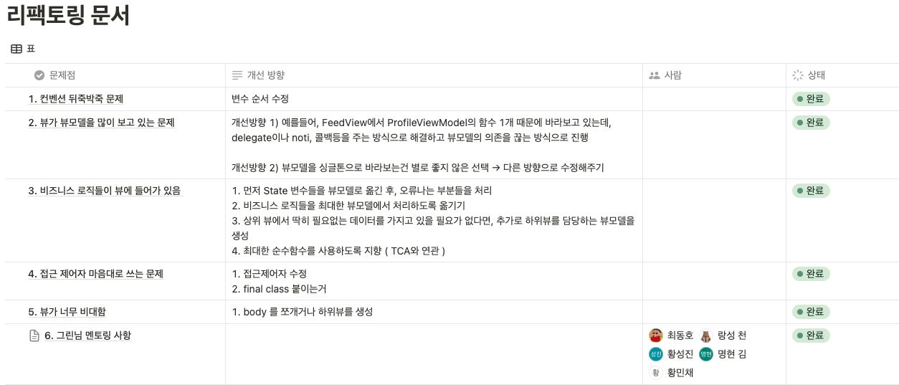
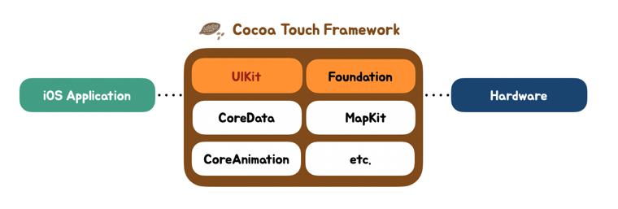
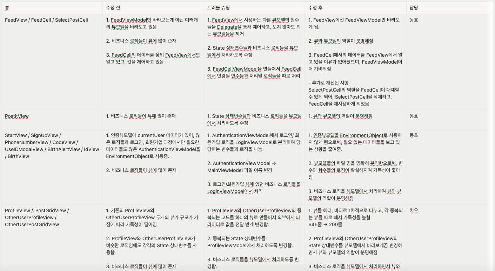
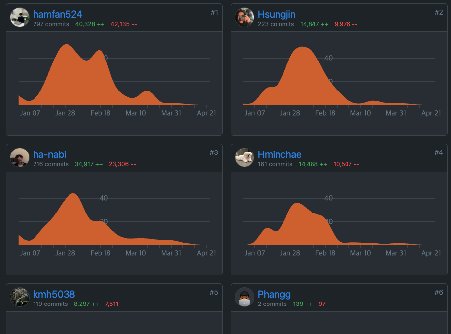

## ❗️개요

[노션 링크](https://www.notion.so/PADO-b006428235254af9a374e759757fdc74)

[파도](https://hamfan524.github.io/Pado/)를 배포한 뒤, 제일 먼저 진행한 일 중 하나인 리팩토링 내용을 다루려고 한다. 
우린 최대한 출시 일을 앞당기기 위해 기능 만들기에 급급해서 유지보수를 하기 좋은 코드로 개발을 하지 못하였던걸 인지하고 있었고, 배포가 끝난 뒤 바로 리팩토링을 들어갔었다.


## 🐞 문제 정의



우선 우리끼리 먼저 현재 파도 프로젝트에서의 문제점을 찾아 정리하였다.  
개선해야할 방향도 정리하여 리팩토링 작업을 시작하였고, 우리가 생각하지 못한 부분들에 대해 조언을 받기 위해 개발자 그린님께 찾아가여 따로 멘토링을 받았다.

### 🍏 그린님 멘토링 사항

우리는 먼저 앱과 코드들을 보여드렸고, 그리님께서 코드를 며칠동안 보시고 조언해주신 내용들을 정리하였다.

1. Dead 코드 정리 

2. 햅틱헬퍼 싱글톤 파일 따로 분리
    -  의존성 주입 또는 싱글톤 아닌 방법을 고려

3. .onAppear 안에서 Task로 비동기 처리 → .task{ }라는 모디파이어 적용하는걸 추천
    - 둘 다 기능은 같으나 비동기 처리만 따로 빼서 처리하는걸 추천

4. 대댓글 부분 에니메이션이 어색함
    - 데이터를 받아오는동안 프로그레스가 돌아가고 다 받아오면 화면이 보이도록

5. ContentsView.swift → 탭뷰 등의 네이밍 수정 필요

6. 파라미터 두개 이상의 경우 개행 컨벤션 추천

예시)
```Swift 
FeedView(
  feedVM: ~~
  dfadsf: ~~
)
.tag(3)
```
7. 뷰 모디파이어들 하나로 관리하는 것을 추천

8. .onChange 을 쓸때 어떠한 액션없이 쓰는것을 지양
    - 앱스킴을 분리하여 딥링크방식을 채택, 딥퍼드 딥링크 방식을 알아보는 것을 추천

9. ViewBuilder 사용
    - 재활용 가능성을 판단하여 사용
    - 코드 자체의 양은 똑같음, 뷰빌더 내부 프로퍼티 → 해당 뷰에서만 사용이 가능하다는 단점이 있지만 나중에는 어떻게 될지 모르기 때문에 struct 로 나누는 것을 선호하고 추천함
    - 하지만 주입받아서 써야하는것이 너무 많을 때 뷰빌더와 내부 프로퍼티 사용을 추천

10. @mainActor 필요 없는 경우를 판단하여 제거 필요

11. 뷰모델의 인스턴스 생성
    - 상위부터 의존성을 주입하여 사용하는것을 지양
    - 의존성을 어떻게 관리할것인가, 의존성 컨테이너에서 어떻게 관리하면 편할지 고민하는 것이 좋음

12. 코드가 가로로 길어지는 경우를 수정이 필요
    - 여러 라이브러리를 참고해보고 많은 사람들이 쓰는 컨벤션을 써보는것을 추천

13. 로티 enum으로 작성해서 관리

14. model 폴더에 import Foundation 을 중복하여 사용하지 않아도 됨
    - Foundation 과 SwifUI, UIKit : 프레임워크 구성 자체가 조금 다름 
    
    - UIKit, SwiftUI → 사용자와의 인터렉션을 주로 다르는 둥 목적이 다름 

15. 인코딩기능이 필요없는 모델들은 decodable 로만 수정
    - 기본적인 사용 이유를 물어볼 것, decodable과 codable 사용 목적을 명확히 할 것
    - identiable, hashable 도 같은 경우


위 15개 내용 이외에도 추가로 많은 도움을 주셨고, 최대한 반영해서 목표를 설정하였다.


## 🙋🏻‍♂️ 리팩토링 진행 후 결과

먼저 데드코드 정리 같은 간단한 내용들은 같이 모여서 작업을 진행하고,
이후 각자 화면단위로 담당하여 리팩토링을 진행하였다.



여기서 나는 피드, 방명록, 시작/로그인 화면들을 맡고 리팩토링을 진행하였다.

사실, 리팩토링한 부분들을 코드들을 보면서 자세하게 작성을 하고 싶지만, 너무 많아서 결과만 정리해보면.. 


```
피드 뷰 리팩토링 결과

- Delegate 패턴을 적용해서 뷰에서 안 바라봐도 되는 뷰모델들의 연결을 끊어줌

- 같은 기능을 하는 FeedCell과 SelectPostCell을 합쳐서 뷰를 재사용하게 됨

- 비즈니스 로직들을 뷰에서 뷰모델로 이동
```


```
방명록 뷰 리팩토링 결과

- 비즈니스 로직들을 뷰에서 뷰모델로 이동
```


```
시작 / 가입 뷰 리팩토링 결과

- AuthenticationViewModel을 EnvironmentObject로 사용하고 있었는데, 
  MainViewModel과 LoginViewModel 두개로 나누어 EnvironmentObject로 사용할 뷰모델이 가벼워짐

- 비즈니스 로직들을 뷰에서 뷰모델로 이동
```


사실 이런 큰 작업들 외에, 변수명들 컨벤션과, 필요없이 바라보고 있는 라이브러리들,  
사소한 애니메이션 처리 등 유지보수 할 때, 코드가 통일감이 최대한 느껴지도록 정리하였다.




리팩토링 후 컨트리뷰터를 확인해보니 나는 +보다 -가 더 많은걸 확인할 수 있었다..ㅎ


## 🥹 후기

초반엔 리팩토링을 진행하며 코드들의 줄 수가 줄어들 때마다 희열감을 느꼈지만, 고칠 때마다 수정해야할 곳들이 떠오르는게 손으로 목욕탕 물을 비워내는것 같은 느낌이 들어 한숨이 계속 나왔다..

3주가 넘는 기간동안 리팩토링하며 가장 크게 느낀건,,  
개발 초기에 팀원들과 확실한 컨벤션을 잡고 가면 이런 대공사가 없었을 것이라는 점!

기능 개발에만 급급해서 만들었던 코드들이 우리에게 남들보다 2,3배는 더 걸리는 리팩토링 기간을 안겨주었고, 절대 우리에게 도움이 되지 않는다는 걸 확실하게 배웠다.

나는.. 다시는 이런식으로 미래를 희생하는 개발은 하지 않을것이다.

```toc
```