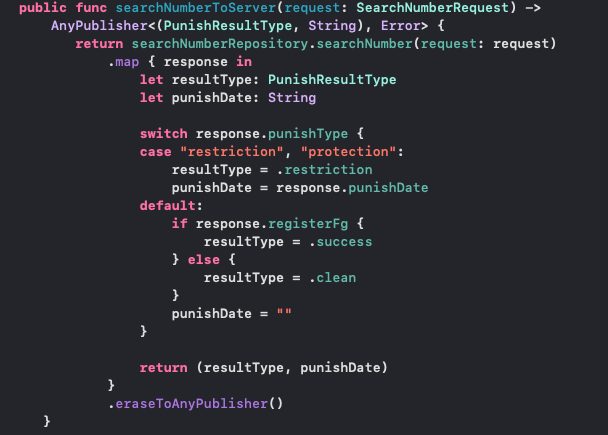
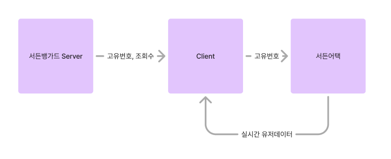

## 🎉 결과물

[앱스토어링크](https://apps.apple.com/kr/app/%EC%84%9C%EB%93%A0%EB%B1%85%EA%B0%80%EB%93%9C/id6670616799)


### GitHub url

[SuddenVanguard](https://github.com/Svanguard/SuddenVanguard)

[SuddenVangaurd - Admin](https://github.com/Svanguard/SuddenVanguard-Admin)


## ⭐️ 프로젝트 시작

사실 이번 프로젝트에 처음에는 참여할 생각이 없었다.  
 나는 ‘에이틴’ 프로젝트에서 PM 역할과 iOS 개발을 동시에 맡고 있어 이미 바쁜 상황이었다.   
 더군다나, 처음 기획을 들었을 때 내가 특별히 필요하지 않을 것 같다고 생각했다.  

그러나 에이틴 앱에서 디자인과 서버 개발이 지연되면서 iOS 개발은 기다리는 상황이 되었고, 자연스레 시간이 생겼다.  
 그 즈음, 서든뱅가드 PM분께서 디자인이 모두 완료되었으니 참여 의사가 있냐고 물어보셔서 프로젝트에 합류하게 되었다.


## ⌛️ 프로젝트 진행

### 🖥️ 서버

처음에는 데이터를 저장할 곳으로 파이어베이스를 사용할 계획이었다.  
하지만 기획 상 조회수를 기준으로 내림차순으로 데이터를 받아와야 하는 경우가 있었고, 파이어스토어는 데이터 양이 많아질수록 내림차순 조회 시 속도가 느려지는 문제가 있었다.  
이 때문에, 현업에서 일하는 대학 후배에게 부탁해 자체적으로 서든뱅가드 서버를 구축하게 되었다.

### 🏛️ 설계

프로젝트에 처음 참여했을 때, 개발되어 있던 코드를 살펴보니 PM분이 1인 개발로 배포를 목표로 진행 중이어서 코드가 기능별로 분리되지 않은 상태였다.  
뷰에서 비즈니스 로직을 처리하거나, 뷰모델에서 데이터 가공과 통신을 모두 처리하는 등 중복된 코드가 많고 일관성도 떨어졌다.  

혼자 개발할 때는 큰 문제가 되지 않을 수 있지만, 내가 참여한 이후와 향후 배포 및 유지보수를 고려했을 때, 구조를 처음부터 새로 잡아야겠다고 판단했다.  
그래서 FigJam을 이용해 데이터 흐름을 작성하며 리팩토링을 시작했다


현재 데이터의 흐름을 기준으로 설계한 SuddenVanguard의 구조이다.

DIP를 준수하여, ViewModel - UseCase - Service - Repository로 나눠지는 역할에 따른 로직을 모듈화 하여 CleanArchitecture/MVVM 패턴을 적용하였다.

이렇게 역할을 분리하기 위해 엎다보니, 기존 프로젝트에선 View파일들만 가져오고 나머지 파일들은 전부 버리고 시작하였다.

### 🌪️ Tuist 도입

기왕 View를 제외한 모든 파일을 엎는 김에 프로젝트를 모듈화하여 관리하기 위해,Tuist를 사용하여 Xcode 프로젝트를 새로 생성 하였다.


현재 개발이 완료된 서든뱅가드의 모듈화된 모습이다. 
Tuist를 사용하여 모듈화하여 가져온 이점은 먼저, 빌드 시 변경된 부분만 빌드하면 되기에, 빌드 속도가 상당히 향상되었다.
또, 모듈간 결합도를 낮추고 응집도를 높이는 형태를 강제적으로 만들어주다보니, 유지보수성이 상당히 증가하였다.
마지막으로, .pbxproj에 UUID의 conflict를 줄여주어서 같이 작업을 하며 생기는 불편함이 많이 줄었다.

### ☕️ 비동기 데이터 관리

프로젝트 초기에는 DispatchQueue를 활용해 비동기 데이터를 처리하고 있었지만, 우선 이를 async/await 함수로 전체적으로 수정하였다.

이후, 개발을 진행하다가 데이터 스트림 관리를 보다 효율적으로 처리하기 위해 Combine을 적용하여 전체코드들을 수정하였다. 
이 과정에서 Combine의 퍼블리셔(publisher)와 구독자(subscriber) 패턴을 통해 비동기 데이터 흐름을 관리하면서 코드의 가독성과 유지보수성을 크게 개선할 수 있었다.

우선, Service에선 비즈니스 로직을 담당하여, 비동기 작업을 수행하고, Combine의 Publisher로 반환한다. 이렇게 데이터를 구독할 수 있는 스트림을 생성해준다.



위 코드에서 Service는 Publisher를 통해 외부 API 호출 결과를 방출한다.

ViewModel에선 Publisher로부터 데이터를 구독하여 UI상태를 업데이트하는 역할을 담당한다.
ViewModel에서 Subscrivber를 사용해 Service가 반환하는 Publisher를 구독하고, 데이터가 변경되면 자동으로 반응하게 처리하였다.


위 코드에서 보이듯이 Publisher를 구독하고, 데이터 스트림을 통해 데이터를 받아 UI에 반영한다.

Combine을 사용함으로써, 서비스와 UI 사이의 데이터 흐름을 명확하게 정의할 수 있었고, 반응형 프로그래밍을 조금 더 효율적으로 처리할 수 있었다.

### 🧑🏻‍💼 관리자 앱

기획 상 유저들이 핵으로 의심되는 유저의 정보들을 우리에게 보내주면, 우리는 그 정보를 확인한 후 서버에 등록하는 과정이 있는데, 이 부분을 간단하게 해결하려면 관리자들을 위한 서비스가 있어야했다.

그런 부분을 쉽게 해결하기 위해 내가 담당하여 관리자 앱을 만들었다.
혼자 개발하여 관리하면 되었기에, Tuist는 적용하지 않고, SuddenVanguard와 동일한 설계로 CleanArchitecture/MVVM 패턴을 적용하였다.

디자인은 사실 기존 서든뱅가드와 비슷한 UI로 개발하였기에, Figma로 따로 디자인을 그리지 않고 필요한 화면을 바로바로 만들었다.
기능은 관리자 로그인 / 핵의심 유저 등록 / 등록된 유저 삭제 / 데이터 조회 이렇게 4개로, 서버 API 문제로 인한 하루 딜레이 된 부분을 제외하면 3일만에 개발이 완료되었다.


### ❓ 겪었던 문제들

사실 프로젝트 규모가 크지도 않고, 어려운 기술이 요구되는 프로젝트가 아니어서 트러블 슈팅이라고 할만큼 큰 문제들은 없었다.

그래도 조금 막혔던 부분들이 있다면, 첫번째로 기획쪽에서 포기하게 된 기능이 있다.
사실 매일매일 제재를 받는 유저들의 데이터들을 앱 내에서 보여주고 싶었다. 

하지만...


위에서 보이듯이 서든어택 서버에선 제대를 받는 유저들의 아이디나 고유번호들을 제공해주지 않는 문제가 있어, 어쩔 수 없이 포기하게 되었다. ㅠ

두번째는 유저가 위장 닉네임 아이템을 사용하여 닉네임을 변경하면 서든어택 서버에서 보여지지 않는 문제였다.

그래서 우리 서든뱅가드에선 유저의 닉네임을 보관하는게 아닌, 유저의 고유번호를 저장하고, 서버에서 고유번호를 받아온 후, 고유번호를 이용하여 서든어택에서 실시간 이름과 사진을 받아와서 화면에 보여주도록 처리하였다.



위와 같은 구조로 데이터를 요청하고 받도록 설계하였고, 우리는 테스트로 등록된 유저의 수가 많다는 가정으로 서든어택에 한번에 많은 데이터 병렬처리하여 요청해 보았더니, 429 에러와 함께 5분동안 IP가 벤 당하는 현상을 볼 수 있었다.

Data영역에서 Service 구현부에서 DataStore를 이용하여 문제를 해결하였다.

서든 뱅가드 서버에서는 데이터를 한번에 받아온 후, 서든병영 사이트에 한 번에 요청하지 않고, 먼저 10개의 데이터만 요청하여 받아온 뒤, 페이징 관리와 무한스크롤을 통해 추가 데이터를 순차적으로 요청하도록 처리하여 문제를 완화하였다.

이렇게 데이터를 페이징처리하였더니, 서버 벤 문제를 해결하여 안정적인 데이터 요청이 가능해졌으며, 유저들에게 끊김 없는 서비스를 제공할 수 있게 되었다.

## 🌝 후기

PM(Publisher) / iOS / BackEnd 이렇게 3인으로 소수로 팀프로젝트를 진행한게 처음이었다.
모듈화부터 시작해서, 비즈니스로직과 통신로직 전체를 혼자 담당한건 처음이었는데, 생각보다 막힘없이 원했던 기능들을 금방금방 만들 수 있었던게 많이 만족스러운 프로젝트였다. (어려운 기능이 없긴했음)

이제 배포 후, 유저들의 반응을 살핀 후 사용자들의 피드백을 통해 더욱 안정적이고, 편리한 앱이 될 수 있도록 계속 유지보수할 생각이다. 
먼저 게임과 관련된 앱이기에 아무래도 웹사이트를 만들어야 하는게 문제지만.. 3명이서 같이 만들면 금방 만들 수 있을거라 생각한다..ㅎ

```toc
```