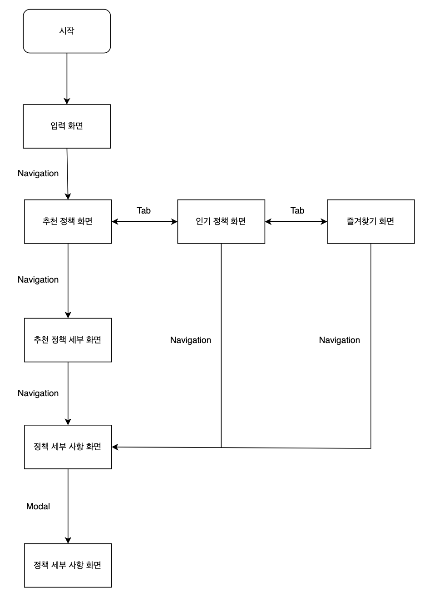
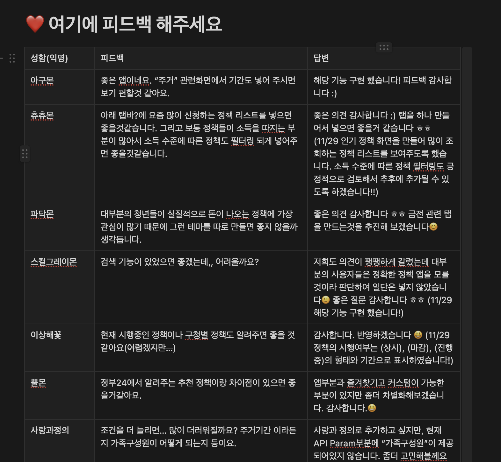
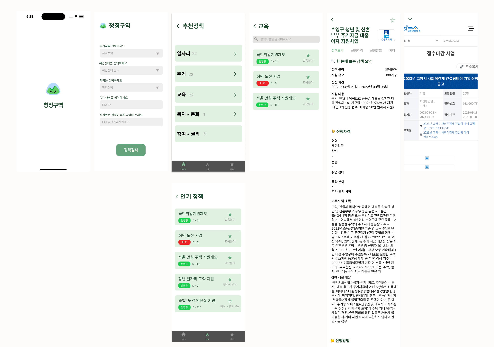
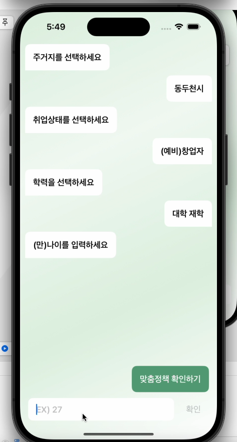
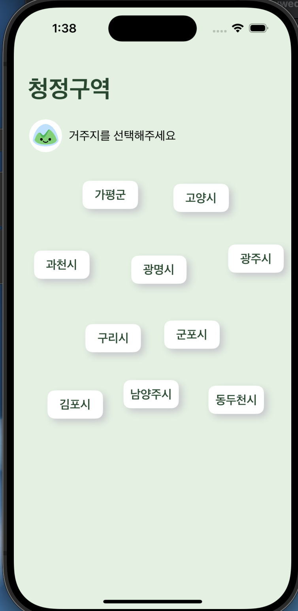
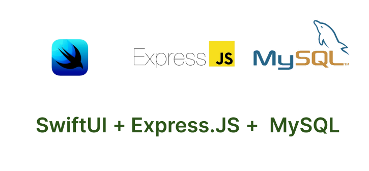
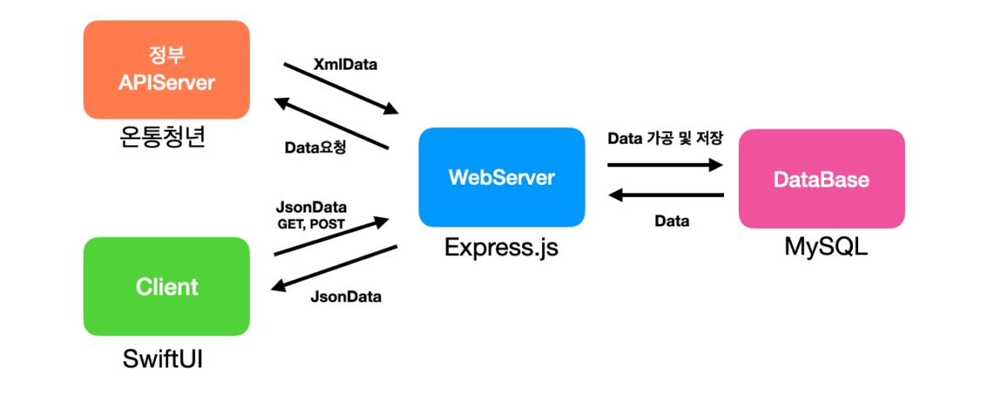
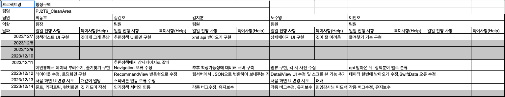
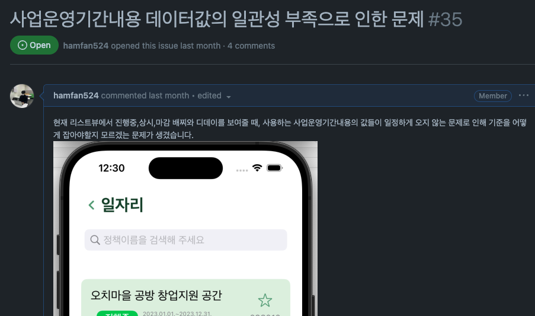
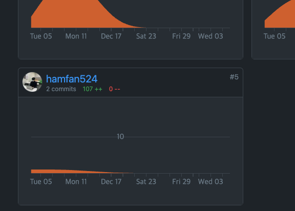

## 🤓 이 글의 목적
내 정보를 입력하면 내가 혜택을 받을 수 있는 정책 정보들을 알려주는 앱이 있으면 좋겠다는 생각을 시작으로 팀원들이 모여 진행하게 된 프로젝트이다. 이 프로젝트는 내가 처음으로 팀장역할을 맡으며 진행하게 된 프로젝트이며, 이 프로젝트의 과정과 경험을 기록해보고자 한다.

[깃헙레포 링크](https://github.com/hamfan524/PJ2T6_CleanArea)

## ⭐️ 프로젝트 시작
사실 이번 팀은 엄청 급조로 만들어졌다. 멋사 3기를 진행하며, 프로그램 커리큘럼에 따라 프로젝트를 하나 진행하게 되었는데, 마땅히 아이디어가 없던 나에게 한 분이 찾아와 같이 작업을 하자하여 팀이 결정되게 되었다. 우리는 앱을 프로젝트로 만든다면 이용자분들 뿐만아니라 우리도 정말 사용하고 싶을만한 앱을 만들고 싶었고, 그렇게 아이디어 회의를 진행하다 나오게 된 아이디어 중 나오게 된 아이디어가 `청정구역`이다.

내 정보를 입력하면, 내가 현재 대상자로 포함되는 정책들을 알려주는 앱을 만들고 싶었고, 우리의 목표는 이용자로서 절대 복잡하지 않은 앱을 만들고 싶은게 1순위였다. 그리고 최대한 쉽게 데이터에 접근할 수 있게 하고 싶었다.

### 그렇게 회의를 거듭 진행하며 작성하게 된 순서도



이용자 입장에서 생각했을 때, 내 가족정보나 재산소득정보 등 다양한 정보들을 하나하나 작성해서 회원가입 후에 데이터를 찾아보는 앱들은 이미 충분히 많으며 귀찮고 복잡하다고 생각하였다. 그래서 우리는 최대한 가입도 없이, 그냥 자신의 정보들을 거주지, 취업현황, 나이 등 간단한 정보들만 입력하면 그 정보들에 맞는 정책들을 보여주는 앱으로 기획했다.

## ⌛️프로젝트 진행

### 🎨 디자인

이번 청정구역 앱에서는, 이전 TouchSchool을 개발할 때엔 사용하지 않았던 피그마를 적극적으로 활용하였다. 
다 같이 모여 피그마로 작업을 진행하였으며, 다양한 아이디어들이 나왔지만, 우리는 간단하게 접근하여 최대한 깔끔하게 정보를 전달하는걸 목표로 디자인하였다.

그리고 팀원들 외에도 다른 분들의 의견을 알고 싶어 노션을 이용해 많은 피드백을 받았다.



위 이미지 외에도 정말 많은 피드백들이 있었고, 피드백 하나하나 미래 이용자분들이 원하는 기능이라는 마음가짐으로 회의를 통해 필요하다 생각이 들면 모두 적용해나갔다.

#### 그렇게 그려진 현재 디자인



사실 처음 처음 데이터를 받는 화면을 정말 많이 고민하였다. 특히, 첫 화면을 피그마로도 정하지 못 해서 후보로 있던 3가지 화면을 다 만들어서 실기기로 테스트를 한 뒤에야 지금의 첫 화면으로 정할 수 있었다.

그렇게 버려지게 된 두개의 화면들..ㅠ

<div align="center"; style="display: flex; align-items: flex-start;">&nbsp&nbsp&nbsp&nbsp&nbsp&nbsp&nbsp  

</div>

#### 1. 정보를 앱에서 알려주는 느낌을 주고 싶어 만들었던 챗봇 형태의 화면 
#### 2. 지도 위에 버튼을 만들어 사는 지역을 터치하는 식으로 주거지를 입력하는 화면


이건 사실 미련이지만,,챗봇 형태의 화면은 내가 애니메이션도 다 적용해서 만든 화면인데 버려질 때 정말 마음이 아팠다..

지금은 앱 디자인이 깔끔하게 보이는데 그 땐 작업하면서 다른 화려한 앱들을 보며 사실 많이 아쉬운 느낌이 많이 들었다. 그래서 애니메이션에 집착하고 화려하게 수정을 몇번 시도했었으나, 최대한 간편하고 복잡하지 않게 정보를 전달하려는 앱 컨셉과 맞지 않는 것 같아 다 쓰레기통으로 보내버렸다.

### 📍 진행

TouchSchool에선 내가 데이터를 받아오고 뿌려주는 파트와 파이어베이스에 저장하는 부분을 담당했었는데, 이번 청정구역에선 메인뷰와 다양한 뷰들의 UI를 중점으로 담당하였다. 데이터 받아오는 기능을 구현 하고싶어하는 분들이 많아 나는 UI와 즐겨찾기 기능에 최대한 집중 할 수 있었다.

먼저, 개발에 사용한 기술스택은 다음과 같다.

- 
- 
- 
-  

이번 프로젝트는 백엔드에서 현업으로 일하시던 분이 팀원으로 있어 백엔드 부분을 MySQL을 이용하여 진행하었다.



- MySQL(데이터 저장, 인기정책), SwiftData(즐겨찾기), Express.js(데이터 가공)


### 💡동작 원리



- `WebServer`에서 정부 `APIServer`에 데이터를 요청한 후 수신된 XMLData를 가공
- `WebServer`에서 가공된 데이터를 `MySQL`로 구축된 `DB`에 저장
- 사용자의 iOS 기기에서 쿼리문을 설정하여 `URL`를 요청하면 `WebServer`에서 해당 쿼리문에 맞는 데이터를 `DB`에서 찾은 후 `JSONData`를 송신해서 사용자들에게 정보를 제공

설계된 현재 앱 구조이다. 처음엔 `Client`에서 온통청년에 데이터를 요청해 바로 받아오고, `SwiftData`를 이용해 즐겨찾기 기능을 구현했다. 그리고 파이어베이스에 연동해 이용자들이 열어본 정책들에 count값들을 추가해 인기정책들을 보여주게 구현했었다.

하지만 이용자의 정보를 입력하고 맞춤 정책을 알아보려고 할때마다, 온통청년에서 데이터를 모든 데이터를 받아오고, 받아온 전체데이터에서 필터링을 한 뒤 화면에 보여주는게 너무 비효율적이라는걸 확인할 수 있었고, 우리는 따로 DB를 구현하게 되었다. 

그렇게 `Client`에서는 필요한 정보를 웹서버에 요청하면 서버에서 데이터들을 다 가공해서 전송해주니 앱이 훨씬 더 최적화되었다.

### 📝 진행 일지




매일 프로젝트를 진행하며, 진행일지를 작성하였다. 
나는 뷰와 즐겨찾기 기능에 많이 집중하였고, 뷰를 다 만들고 SwiftData로 즐겨찾기 기능도 다 구현하고 나니 팀원분들 작업을 기다리는 시간이 생각보다 많았다.  마지막날 나는 폰트들을 적용하고 데이터를 받아올 때 보여줄 스플래시 뷰, 전체 코드들의 리팩토링을 하였는데 나는 마지막날이 이번 기간 중에 가장 바쁜 날이었다.

### ❓겪었던 문제

사실 우리 앱이 배포될 수 없게 된 가장 큰 이유이자, DB를 직접 구축하게 된 가장 큰 이유가 있었다.



XML로 데이터를 뿌려주는것도 충격이지만 더 충격이었던건 공공기간 데이터들이 일관성이 진짜 너무 없었다.. 

예를들어, 진행 중인 정책인지 마감된 정책인지 알려주는 부분을 "yyyy.mm.dd.~yyyy.mm.dd."인 줄 알고  구현하고 있었다.
하지만... "~yyyy.mm." , "-yyyy.mm.dd", "null", "종료", "미정" 등등 상상도 못했던 데이터들이 너무나도 많았다.

정책기간 뿐만 아니라 다른 부분에서도 다들 일관성이 전혀 없었고, 결국 우리는 경기도 데이터만 한정하여 DB를 구축한 뒤 데이터를 새로 가공해서 Client에 주는 방식으로 수정할 수 밖에 없었다.

## 🌝 후기

사실 약 5일만에 앱 개발이 완성되었는데, 데이터 문제만 아니라면 바로 배포하고 싶은 앱이다. 팀원분들도 다들 잘하시고, 너무 열정이 넘치셨다. 맡은 파트를 각자 막힘없이 만들어주셔서 팀장인데 팀장으로써 할게 거의 없었다(진짜 거의 한게 없는것 같다...)

아! 그리고 소소한 문제가 있었다.. 프로젝트를 시작하고 주말에 새 맥북을 구매하여 교체했었는데 그때 아무생각없이 로컬 git에 이름과 이메일을 입력해주지 않은 상태로 프로젝트를 계속 진행하였고, 마지막날 main브랜치에 PR을 날리고 Contributors를 확인했더니..



하.. 내 코드들이 다 다른 팀원들 작업으로 흡수되어버렸다.. 물론 내가 작성한 코드들이 뭔지 알고 면접 때 당당히 설명할 수 있지만 뭔가 조금 찝찝한 부분이 생겨버렸다 ㅠㅠ

이번 프로젝트는 배포를 하지 못해 아무런 보상이 없는 프로젝트엿지만, 만들면서 정말 즐거웠고, 나중에 공공기관에서 데이터가 좀 일관성있게 내려와준다면 바로 배포해도 되지 않을까라는 생각이 든다. 다음에도 이번 팀원분들과 비슷한 분들을 만나 즐겁고 열정넘치게 프로젝트에 집중하는 작업을 하고 싶고, 이렇게 즐겁게 프로젝트를 진행할 수 있는 기회가 있다면 감사한 마음으로 참여할 것 같다.

```toc
```