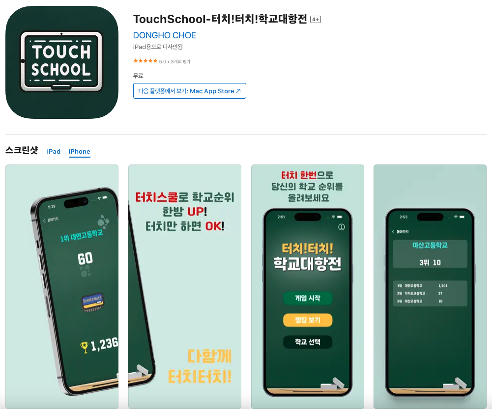
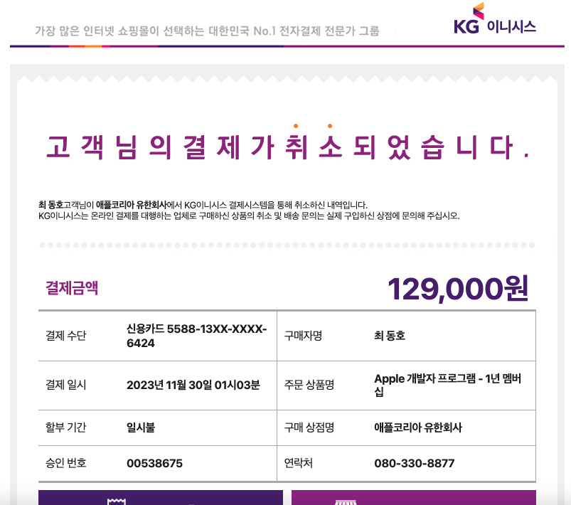
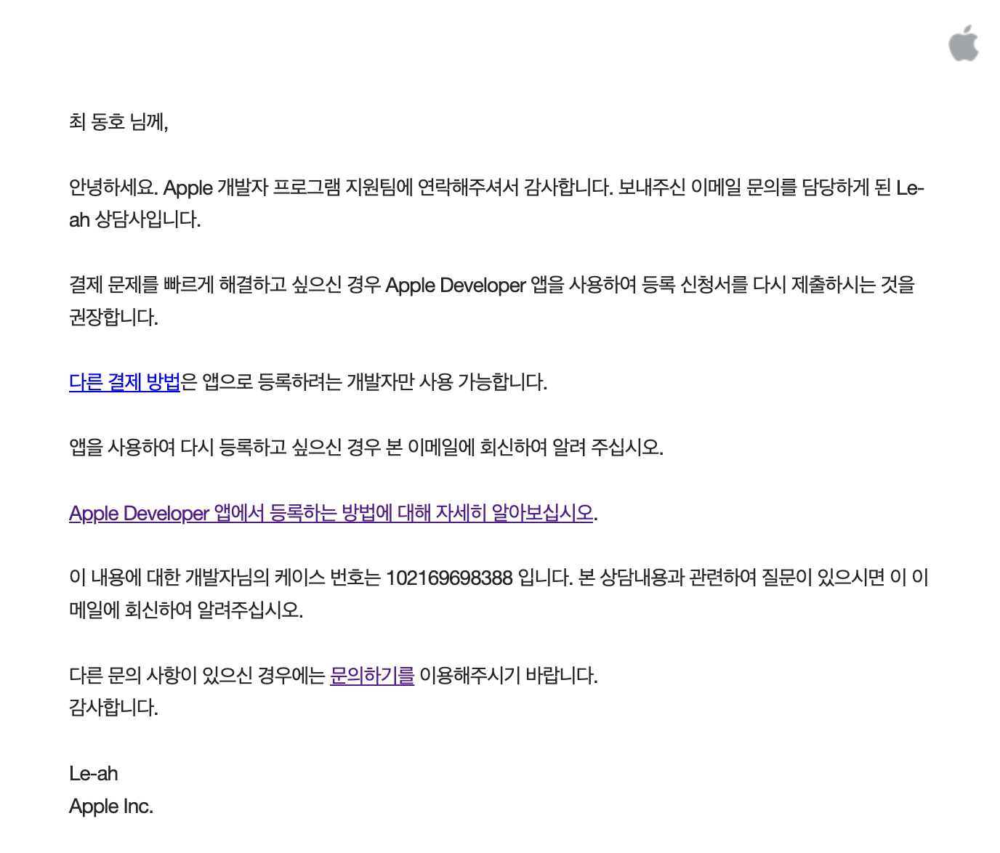
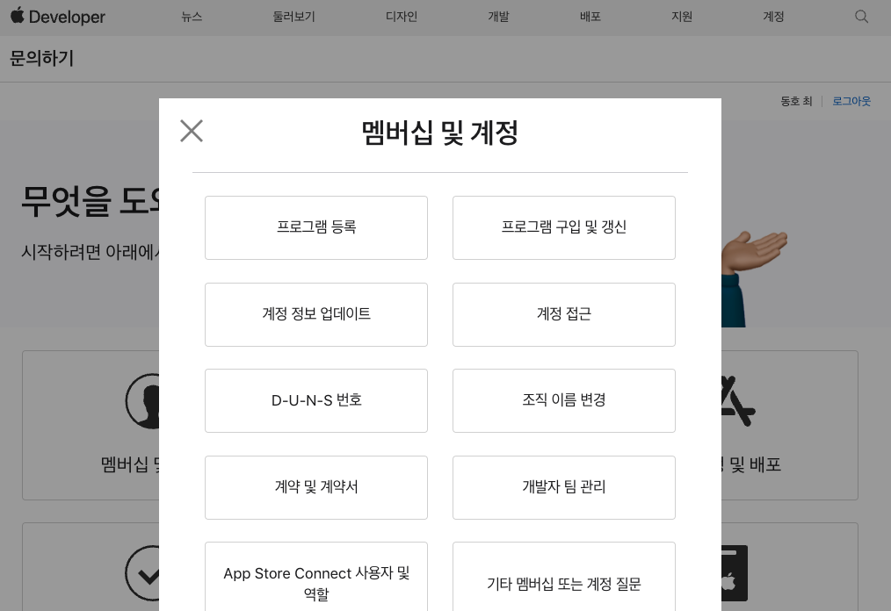

## 🎉 결과물

[앱스토어링크](https://apps.apple.com/kr/app/touchschool-%ED%84%B0%EC%B9%98-%ED%84%B0%EC%B9%98-%ED%95%99%EA%B5%90%EB%8C%80%ED%95%AD%EC%A0%84/id6474486132)



### GitHub url

https://github.com/hamfan524/TouchSchool


## ⭐️ 프로젝트 시작

멋사 3기를 시작하며 같이 공부하는 팀으로 구성되었던 분들과 그냥 학습내용만 매일 공유하며 2주정도 보냈었다.

무언가 시간이 조금 아까운거 같아 공부한 내용들을 활용하여 바로 프로젝트를 하나 진행하면 좋을거란 생각에 팀원분들게 제안을 하였고, 다른 팀들과는 다르게 바로 프로젝트를 들어갈 수 있었다.  
나를 제외한 다른 분들은 Swift 언어가 처음이었고, 나 또한 팀 프로젝트는 처음이라 어려운 주제를 선택하긴 힘들어 3일동안 아이디어 회의를 진행하다 한 유튜브 영상을 보게 되었다.

https://www.youtube.com/watch?v=brYCFFWA_6M

한 중학생이 만든 게임인데 보자마자 지금 우리가 시작하기에 너무 좋다고 생각이 들어 아이디어로 선정하게 되었다.

## ⌛️ 프로젝트 진행

먼저, 개발환경과 라이브러리는 다음과 같다.

- []()  
- []()  
- []()  
- []()  
- []()

### 🎨 디자인

우린 피그마나 포토샵을 이용하지 않고, 뷰를 바로바로 만들면서 디자인을 그려나갔다.  
피그마에 대해 알고는 있었지만, 먼저 피그마로 디자인을 그려두고 개발을 진행해볼 생각을 해보지 않았던게 지금 와서 생각하니 너무 아쉬운 부분이다. (중간에 디자인이 3번이나 바뀌는 고통스러운 작업이 있었다.)

### 📍 진행
먼저 우리팀은 매주 2번 디스코드로 회의 시간을 정해 그날 모여서 작업물들을 공유하였고, `GitFlow`를 적용해서 각자 뷰를 1개씩 잡아 개발을 진행하였다. 
나는 학교를 검색하고, 선택하면 메인화면으로 넘어가는 화면을 맡았다.
커리어넷에서 초,중,고등학교 정보를 URLSession으로 받아오는 코드를 작성했고, 추후에 팀원분께서 `URLSession`코드를 이해하는걸 어려워 하셔서 `Alamofire` 코드로 변경되었다.

학교를 선택하면 파이어베이스에 그 학교가 있다면 학교정보를 받아오고, 없다면 파이어베이스에 학교를 추가하면서 점수를 0점으로 만들어주는 기능도 같이 구현하였다.  

그리고 게임뷰에서 터치 이벤트가 조금 심심한 것 같아, 터치한 부분에 smoke 이미지가 나타나고, 1초동안 smoke가 회전하면서 사라지는 이벤트도 구현하였다. (사실 이 부분이 내가 만든 기능 중에 가장 마음에 든다)  

또, 다른 팀원분들은 `Swift`가 처음이라 조금 어려워하시는 부분들이 있었으며, 그 부분들을 같이 해결해주면서 같이 학습해 나갈 수 있었다.

### ❓ 겪었던 문제들
사실, 프로젝트 개발은 그렇게 오래걸리지 않았다.  
뷰가 그렇게 많지도 않았고, 학교선택 -> 메인화면 -> 게임화면 - 화면터치 시 점수 올라가는게 전부였다. 파이어베이스에 연동하는 부분도 금방 해결이 되어 개발은 예상보다 훨씬 수월하게 되었으나, 몇몇 작은 문제들과, 배포에서 정말 많은 고통을 받았다 ㅠ

#### 먼저 GameView에서 멀티 터치가 안되던 문제가 있었다.  
>`SwiftUI`는 직접적인 멀티터치 처리를 위한 API를 제공하지 않기에 기본적인 `onTapGesture` 대신에 더 낮은 수준의 이벤트 처리를 사용하여 해결하였다.

#### 멀티터치와 함께 생긴 오류였는데, 터치 효과음과 관련하여 오류가 있었다.   
>사운드 부분을 담당하신 팀원분께서 참고하였던 블로그의 코드는 버튼을 클릭할 때 마다, 매번 새로운 객체를 생성하고 있었고, 이 부분이 성능을 저하시키는 문제가 있었다.  
또, 메인 스레드에서 오디오를 재생해서 화면이 뚝뚝 끊기는 문제가 있어 코드를 많이 수정하게 되었다.
>
>각 사운드 별로 객체를 사전에 생성하고 미리 저장해 두는 방식으로 클래스를 수정하고,  
 오디오 재생을 백그라운드에 스레드에서 수행하도록 변경해주면서 해결할 수 있었다.

그러나 이런 코드들의 문제보다 가장 큰 문제는 따로 있었다.  
#### 배포를 위해 Apple Developer 등록을 진행하는게 너무나도 험난했다..




진짜 아무런 이유도 없이 결제가 계속하여 취소되는 일이 있었는데, 처음엔 주소를 잘못 입력했나보다 싶어 다시 진행하였다.  
하지만 또 다시 취소가 되는 일이 생겨 카드가 문제인듯하여 다른 새 카드를 새로 발급 받고, 그 뒤에 다시 진행하였으나 결과는 똑같이 '결제취소'였다..




그렇게 메일을 보냈으나, 온 답변은 앱으로 등록을 진행하라는 것이었고, 이미 3번째 새카드로 등록을 할땐 앱으로 진행한 나에겐 전혀 도움이 되지 못했다 ㅠ

이렇게 개발자 등록에만 결제취소 3번, 새카드발급, 문의 답변시간까지 총 3주라는 시간을 허비했으나, 해결은 허무하게 금방 되었다.




처음 여기서 전화로 문의를 했을 땐, 상담사님께서 카드 문제일 수도 있다고 해서 카드를 재 발급 받았었으나,  
결국 새카드도 되지 않아, 다시 전화를 하니 상담사님께서 이전에 내가 등록하고 있던 과정 모두를 삭제해 주셨고, 초기화 한 상태에서 다시 진행하니 바로 등록이 되었다.

그렇게 해결된 우리는 드디어 처음으로 앱을 배포할 수 있었고, 현재는 AppStore에서 TouchSchool을 이용할 수 있다.

#### 그리고, 배포 후 다른 사용자분들이 알려주셔서 알게된 오류가 있다.

게임화면에서 화면을 아주 많이 터치하다보면 어느순간부터 화면이 버벅이고 멈추는 현상이 있었다.
우리 팀원들도 실기기로 테스트를 많이 진행했었지만, 몇천번 이상 터치를 진행해보지는 않았었기에 몰랐던 오류였다.

화면을 터치하면 터치한 곳에 연기가 나타나고 1초동안 그 연기가 돌아가면서 사라지는 효과를 넣었었는데 이 부분이 문제였다.

`smokes` 배열에 화면 탭 이벤트마다 새로운 `Smoke` 객체가 추가되어 사용자가 화면을 많이 탭할수록 배열의 크기가 계속 증가하는 상태였고, 배열의 크기가 점점 커지다보면 각 탭 이벤트에 더 많은 인스턴스를 렌더링해야하는 문제가 있었다.

이 문제를 해결하기 위해, 이틀동안 회의를 진행했었고 회의한 기간에 비해 생각보다 훨씬 간단하게 아이디어로 해결할 수 있었다.
회의 중에 FPS총게임에서 벽에 총을 쏘다보면 총알 자국이 어느순간 사라지는게 떠올랐고, 우린 그렇게 `smokes` 배열의 인덱스를 30으로 제한을 주었다.
객체를 배열에 추가하기 전에 배열의 크기가 이미 30이면, 가장 오래된 요소(0번 인덱스)를 제거하고, 새로운 요소를 배열에 추가하게 변경하였다.  
이 방식은 `smokes` 배열의 크기를 일정하게 유지하여 각 탭 이벤트에 대해 일정한 수의 `SmokeEffectView` 인스턴스만 렌더링하도록 보장하였고, 화면이 버벅이는 문제를 해결할 수 있었다.


## 🌝 후기

### 👏 의미 있는 프로젝트

이번 프로젝트는 우리에겐 팀프로젝트로써, 기획부터 배포까지 모두 처음이라는 부분에서 큰 의미가 있었다.  
또, GitFlow를 이용하여 프로젝트를 진행하며, 정말 많은 충돌들이 있었는데 그 부분을 해결하며 많은 성장을 할 수 있었다.

처음은 Swift언어로 코딩이라는 부분에 중점을 맞추었던 프로젝트였으나, 정말 많이 배우고, 고통받았던(?) 부분들은 오히려 협업, 배포 쪽이었다는게 나에겐 큰 경험이 되었다. 배포와 유지보수까지가 개발이다!

### 🧑‍💻 마무리

생각보다 팀원분에게 도움이 많이 된 것 같아 다행이다.  
사실 피그마로 디자인 작업을 못해본게 아쉬워서, 다음 프로젝트부턴 꼭 피그마로 디자인 작업을 먼저해야겠다고 생각도 든다. 나름 고생하면서 작업했던 부분들도 나에게 큰 지식이 되어서 뿌듯하기도 하고, 앱에 광고를 넣어뒀는데 작지만 다른 이용자분들께서 사용하면서 광고비용이 들어오는게 너무 신기하다. 

이번 프로젝트가 나에게 작지 않은 경험이었다고 생각하고, 좋은 팀원분들과 함께할 수 있어서 너무 즐거운 개발기간이었다.👏🏻


```toc
```